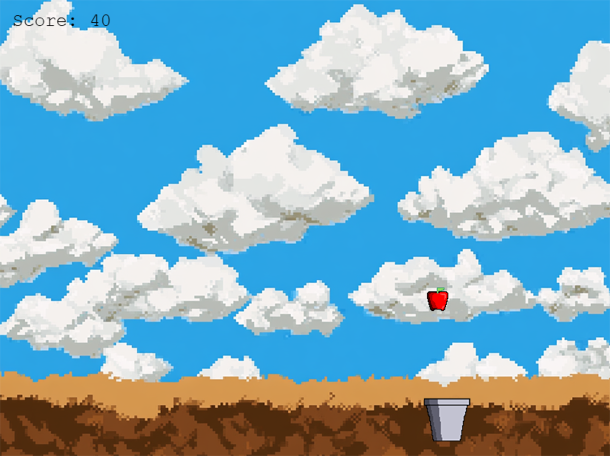

# Catch-The-Apples

Catch the Items - JavaScript Game for Learning



This game is the end result of following [this tutorial on how to make a 2D Retro Game](https://www.howtomakegames.org/phaser-tutorials/how-to-make-2d-javascript-game-1/) 

There is a [playable version of this game here](https://jeremymorgan.itch.io/catch-the-apples)

## Description

Catch-The-Apples is a simple game built using the Phaser 3 framework. The objective of the game is to catch falling apples using a player-controlled pail. This project is designed to help beginners learn the basics of game development with JavaScript and Phaser.

## Features

- Player-controlled pail to catch falling apples
- Simple physics using Phaser's arcade physics system
- Easy to understand and extend

## Installation

1. Clone the repository:
    ```sh
    git clone https://github.com/yourusername/Catch-The-Apples.git
    ```
2. Navigate to the project directory:
    ```sh
    cd Catch-The-Apples
    ```
3. Open `index.html` in your web browser to start the game.

## Usage

- Use the arrow keys to move the pail left and right.
- Catch as many apples as you can to score points.

## Contributing

Contributions are welcome! Please fork the repository and create a pull request with your changes.

## License

This project is licensed under the MIT License. See the [LICENSE](LICENSE) file for details.

## Acknowledgements

- [Phaser 3](https://phaser.io/phaser3) - The game framework used
- [jsDelivr](https://www.jsdelivr.com/) - CDN for Phaser library
